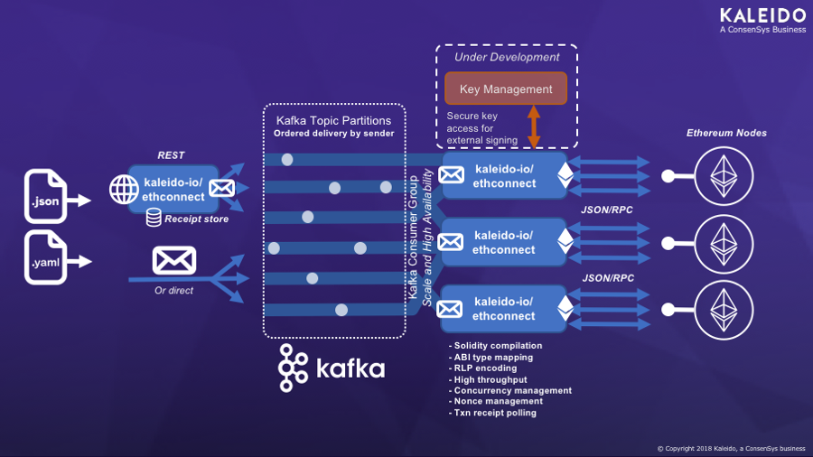
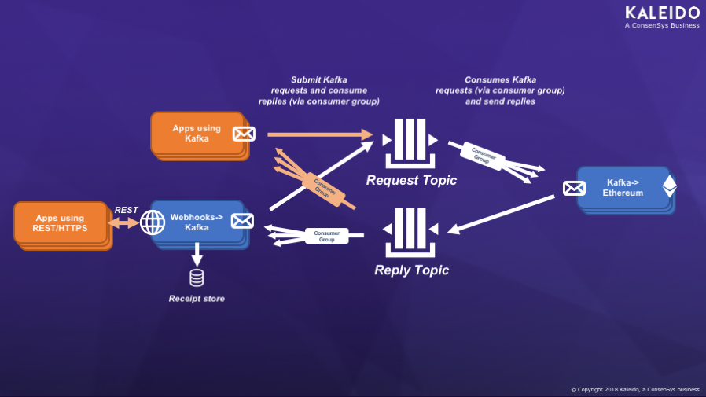

# github.com/kaleido-io/ethconnect

[](https://codecov.io/gh/kaleido-io/ethconnect)

- [github.com/kaleido-io/ethconnect](#githubcomkaleido-ioethconnect-20)
  - [Kaleido's Ethconnect REST Gateway](#kaleidos-ethconnect-rest-gateway)
  - [License](#license)
  - [Example payloads](#example-payloads)
    - [YAML to submit a transaction](#yaml-to-submit-a-transaction)
    - [YAML to deploy a contract](#yaml-to-deploy-a-contract)
  - [Why put a Web / Messaging API in front of an Ethereum node?](#why-put-a-web--messaging-api-in-front-of-an-ethereum-node)
  - [Why Messaging?](#why-messaging)
  - [The asynchronous nature of Ethereum transactions](#the-asynchronous-nature-of-ethereum-transactions)
    - [Ethereum Webhooks and the REST Receipt Store (MongoDB)](#ethereum-webhooks-and-the-rest-receipt-store-mongodb)
    - [Nonce management for Scale and Message Ordering](#nonce-management-for-scale-and-message-ordering)
  - [Why Kafka?](#why-kafka)
  - [Topics](#topics)
  - [Messages](#messages)
    - [Example transaction receipt](#example-transaction-receipt)
    - [Example error](#example-error)
  - [Running the Bridge](#running-the-bridge)
    - [Installation](#installation)
  - [Development environment](#development-environment)
    - [Ways to run](#ways-to-run)
    - [Running the Kafka->Ethereum bridge via cmdline params](#running-the-kafka-ethereum-bridge-via-cmdline-params)
    - [Running the Webhooks->Kafka bridge via cmdline params](#running-the-webhooks-kafka-bridge-via-cmdline-params)
    - [Example server YAML definition](#example-server-yaml-definition)
  - [Tuning](#tuning)
    - [Maximum messages to hold in-flight (maxinflight)](#maximum-messages-to-hold-in-flight-maxinflight)
    - [Maximum wait time for an individual transaction (tx-timeout)](#maximum-wait-time-for-an-individual-transaction-tx-timeout)

## Kaleido's Ethconnect REST Gateway

A Web and Messaging API, taking the hassle out of submitting Ethereum transactions:
- Solidity compilation
- ABI type mapping
- RLP encoding
- Transaction receipt polling
- High throughput tx submission
- Concurrency management
- Nonce management

Provides an integration bridge into Ethereum permissioned chains, from simple
Web Service and Messaging interfaces that are friendly to existing Enterprise
applications & middleware.
For example to allow connectivity from an Enterprise Service Bus (ESB) or other
Enterprise Application Integration (EAI) tier, or applications running in a
Java EE Application Server.

[](ethconnect.pdf)

Technology support currently includes:
- Messaging
  - Apache Kafka - https://kafka.apache.org/
- Webhooks
  - Simple `POST` of a transaction over HTTP in YAML/JSON queued to Kafka for processing
  - REST store to query results (backed by MongoDB)

Under development:

- Key Management Service
  - AWS Key Management Service - https://aws.amazon.com/kms/

## License

This code is distributed under the [Apache 2 license](LICENSE).

> The code statically links to code distributed under the LGPL license.

## Example payloads

The HTTP Webhooks and Kafka message payloads share a common schema.
For HTTP you can specify `Content-type: application/x-yaml` and send
in a YAML payload, which will be converted to JSON.

When sending messages to Kafka directly, JSON must be sent.

### YAML to submit a transaction

Send a transaction with parameters to an existing deployed contract.

```yaml
headers:
  type: SendTransaction
from: 0xb480F96c0a3d6E9e9a263e4665a39bFa6c4d01E8
to: 0xe1a078b9e2b145d0a7387f09277c6ae1d9470771
params:
  - value: 4276993775
    type: uint256
gas: 1000000
methodName: set
```

### YAML to deploy a contract

Ideal for deployment of simple contracts that can be specified inline (see #18).

```yaml
headers:
  type: DeployContract
from: '0xb480F96c0a3d6E9e9a263e4665a39bFa6c4d01E8'
params:
  - 12345
gas: 1000000
solidity: |-
  pragma solidity >=0.4.22 <0.6.0;

  contract simplestorage {
     uint public storedData;

     function simplestorage(uint initVal) public {
        storedData = initVal;
     }

     function set(uint x) public {
        storedData = x;
     }

     function get() public view returns (uint retVal) {
        return storedData;
     }
  }
```

## Why put a Web / Messaging API in front of an Ethereum node?

The JSON/RPC specification exposed natively by Go-ethereum and other Ethereum
protocol implementations, provides a rich low-level API for interfacing with
the node. It is usually exposed over HTTP (as well as IPC) so can be connected
over a network, and have security layered in front of it (as has been done within
the Kaleido platform).

However, applications seldom code directly to the JSON/RPC API when deploying
contracts and sending transactions, because it is:
- Asynchronous in nature, needing polling to obtain a transaction receipt
- Based on Recursive Length Prefix (RLP) encoding of payloads

Instead thick client libraries such as [web3.js](https://github.com/ethereum/web3.js/), [web3j](https://github.com/web3j/web3j), [web3.py](https://github.com/ethereum/web3.py), [Nethereum](https://github.com/Nethereum/Nethereum) and [ethjs](https://github.com/ethjs/ethjs) are used to submit transactions.

These thick client libraries perform many of the same functions as kaleido-io/ethconnect, simplifying submission of transactions, receipt checking,
nonce management etc.

In the modern world of Microservice architectures, having a simple, efficient
and stateless REST API to submit transactions is a desirable alternative. A small self-contained, optimized, and independently scalable layer that can exposing a simple API that can be consumed by any application, programming language, or Integration tool.

e.g. making it trivial to submit transactions. No coding required, just open up [Postman](https://www.getpostman.com/) and send in some YAML or JSON copied from a README like this one.

In an Enterprise context, the availability of standardized interfaces like HTTP and Kafka means applications and integration tools (a common ESB or other EAI tooling) can be hooked up easily. No need to insert complex code libraries into applications, many of which are LGPL licensed.

## Why Messaging?

So you ask, if the goal is simplicity, why not just put the HTTP API in front of JSON/RPC and be done with it?

There are some challenges in Enterprise grade Blockchain solutions (particularly in high throughput permissioned/private chains) that cannot be solved by a stateless HTTP bridging layer alone.

So for Kaleido, we started with a robust Messaging tier and layered the HTTP interface on top.

## The asynchronous nature of Ethereum transactions

Ethereum transactions can take many seconds or minutes (depending on the backlog and block period) from submission until they make it into a block, and a receipt is available. Each individual node in Ethereum provides a built-in pool where transactions can be buffered while waiting to enter a block.

Connecting a synchronous blocking HTTP interface directly to an inherently asynchronous system like this can cause problems. The HTTP requester times out waiting for a response, but has no way to know if it should retry or if the transaction will eventually succeed. It cannot cancel the request.

Providing a Messaging layer with at-least-once delivery and message ordering, allows the asynchronous nature of Ethereum to be reflected back to the remote application.

Applications that have their own state stores are able to communicate over Messaging / Kafka with simple JSON payloads to stream transactions into a scalable set of Ethereum nodes, and process the replies as they occur. The application can scale horizontally. Applications can also be decoupled from the Ethereum network with an integration technology like an Enterprise Service Bus (ESB).

When spikes in workload occur that create a large queue of transactions that need to be fed into the Ethereum network at a lower rate, the kaleido-io/ethconnect bridge feeds them in at an optimal rate.

### Ethereum Webhooks and the REST Receipt Store (MongoDB)

Another key goal of having a robust Messaging layer under the covers is that any application can send messages into Ethereum reliably.

- `POST` a [trivial YAML/JSON payload](#yaml-to-submit-a-transaction)
  - to `/hook` to complete once the message is confirmed by Kafka (0.5s - tunable)
  - to `/fasthook` to complete immediately when the message is sent to Kafka
- Receive back an `id` for the request straight away
   - Let the bridge do the retry polling to get the Ethereum receipt once a block is cut

This is ideal for Applications, Integration-as-a-Service (IaaS) platforms, and built-in SaaS integrations that support Webhooks for event submission.

However, SaaS administrators and end-users still need to be able to track down what happened for a particular transaction, to diagnose problems, and correlate details of the Ethereum transaction with the business event. See [Messages](#messages) below for details of the responses stored in the Receipt store.

So kaleido-io/ethereum comes with a built-in receipt store, backed by MongoDB. It listens reliably for the replies over Kafka, and inserts each of them into the Database.

It provides a trivially simple REST API:
- `GET` `/reply/a789940d-710b-489f-477f-dc9aaa0aef77` to look for an individual reply
- `GET` `/replies` to list the replies
  - Ordered by time _received_ (not the order submitted) - listing the newest first
  - `limit` and `skip` query parameters can be used to paginate the results

A capped collection can be used in MongoDB to limit the storage. For example to store only the last 1000 replies received.

### Nonce management for Scale and Message Ordering

The transaction pooling/execution logic within an Ethereum node is based upon the concept of a `nonce`, which must be incremented exactly once each time a transaction is submitted from the same Ethereum address. There can be no gaps in the nonce values, or messages build up in the `queued transaction` pool waiting for the gap to be filled (which is the responsibility of the
sender to fill). This allows for deterministic ordering of transactions sent by the same sender.

The management of this `nonce` pushes complexity back to the application tier - especially for horizontally scaled Enterprise applications sending many transactions using the same sender. By using an ordered Messaging stream to submit messages into the Ethereum network, many applications are able to delegate this complexity to kaleido-io/ethconnect.

The kaleido-io/ethconnect bridge contains all the logic necessary to communicate with the node to determine the next nonce, and also to cope with multiple requests being in flight within the same block, for the same sender (including [with IBFT](https://github.com/ethereum/EIPs/issues/650#issuecomment-360085474)).

When using the bridge, an application can submit simple YAML/JSON formatted transactions
in a highly parallel way across many instances using the same sender address to the bridge
over HTTPS/Kafka _without_ a nonce. Then through ordered message delivery and nonce management
code within the kaleido-io/ethconnect bridge it will be assigned a nonce and submitted
into the Ethereum node. The nonce assigned is returned by the bridge in the reply.

If a sender needs to achieve exactly-once delivery of transactions (vs. at-least-once) it is still necessary to allocate the nonce within the application and pass it into kaleido-io/ethconnect in the payload.  This allows the sender to control allocation of nonces using its internal state store / locking.

> There's a good summary of at-least-once vs. exactly-once semantics in the [Akka documentation](https://doc.akka.io/docs/akka/current/general/message-delivery-reliability.html?language=scala#discussion-what-does-at-most-once-mean-)

Given many Enterprise scenarios involve writing hashed proofs of completion of an off-chain transaction to a shared ledger (vs. performing the actual transaction on the chain), at-least-once delivery is sufficient in a wide range of cases. Smart Contracts can be implemented in an idempotent way, to re-store or discard the proof if submitted twice.

An `idempotent` interface is one that can be called multiple times with the same input,
and achieve the same result. By example, if you were using an interface on an online
shopping system and clicked the `Complete order` button twice, you could tell if their
interface was idempotent by whether you received one parcel at your house (idempotent)
or two (not idempotent).

In the case of storing a hashed proof of an external event, this can be achieved quite
trivially. Some examples as follows:
- The hash itself is a key into a map, and if on submission it is already
  found in the map the duplicate submission is discarded (if the other parts of the
  proof such as the originating address or metadata differ, this should be flagged
  as an error).
- There is a transaction identifier known to all external parties to the off-chain
  transaction, and this is used as a key into a map of transactions.
- In a voting scenario with multiple signed copies of a proof being submitted,
  the public address of each sender (whether an Ethereum address, or
  other off-chain cryptography) is used as a key into a map of votes.

## Why Kafka?

We selected Kafka as the first Messaging platform (and built a multi-tenant secured Kafka transport into the Kaleido platform), because Kafka has message ordering and scale characteristics that are ideally suited to the Ethereum transaction model:
- Transactions can be sprayed across partitions, while retaining order of the transactions for a particular sender. Allowing independent and dynamic scaling of the application, kaleido-io/ethconnect bridge and Go-ethereum node components.
- The modern replication based cloud-native and continuously available architecture is ideal for the Kaleido platform, and is likely to be a good fit for the modern Microservice architectures that are common in Blockchain projects.

## Topics

[](ethconnect.pdf)

The topic usage is very simple:
- One topic delivering messages into the bridge
  - The Kafka->Ethereum bridge listens with a consumer group
  - If configured, the Webhook->Kafka bridge sends to this topic
  - The Kafka->Ethereum bridge updates the offset only after a message is delivered into Ethereum, and a success/failure message is sent back (at-least-once delivery)
  - The Kafka->Ethereum bridge keeps a configurable number of messages in-flight - received from the input topic, but not yet replied to
- One topic delivering replies
  - All replies go to single topic, with a header that correlates replies
  - If configured, the Webhook->Kafka bridge listens to this topic with a consumer group
  - The Webhook->Kafka bridge marks the offset of each message after inserting into MongoDB (if the receipt store is configured)

## Messages

### Example transaction receipt

An example successful `TransactionSuccess` reply message, which indicates a transaction receipt was obtained, and the status of that transaction was `1` (a similar payload with `header.type` set to `TransactionFailure` is returned if EVM execution is unsuccessful):
```json
{
  "headers": {
    "id": "3eca1f95-d43a-4884-525d-8d7efa7f8c9c",
    "requestId": "a789940d-710b-489f-477f-dc9aaa0aef77",
    "requestOffset": "zzyly4jg5f-zze37213zm-requests:0:35479",
    "timeElapsed": 23.160396176,
    "timeReceived": "2018-07-25T12:15:19Z",
    "type": "TransactionSuccess"
  },
  "blockHash": "0x7c6d389b27c57a0f5e4792712f1dd61a733230e3188511a6f59e0559c2c06352",
  "blockNumber": "6329",
  "blockNumberHex": "0x18b9",
  "cumulativeGasUsed": "26817",
  "cumulativeGasUsedHex": "0x68c1",
  "from": "0xb480f96c0a3d6e9e9a263e4665a39bfa6c4d01e8",
  "gasUsed": "26817",
  "gasUsedHex": "0x68c1",
  "nonce": "458",
  "nonceHex": "0x1cA",
  "status": "1",
  "statusHex": "0x1",
  "to": "0x6287111c39df2ff2aaa367f0b062f2dd86e3bcaa",
  "transactionHash": "0xdb7578e473767105c314dd73d34b630a193227826bc6ddf6261b45a27405e7e7",
  "transactionIndex": "0",
  "transactionIndexHex": "0x0"
}
```

Numeric values are supplied in two formats for convenience of different receiving applications:
- Simple numeric values, wrapped in strings to handle the potential of big integers
- Hex values encoded identically to the native JSON/RPC interface

The MongoDB receipt store adds two additional fields, used to retrieve the entries efficient on the REST interface:
```json
{
  "_id": "a789940d-710b-489f-477f-dc9aaa0aef77",
  "receivedAt": 1532520942884
}
```

### Example error

In the case that the Kafka->Ethereum is unable to submit a transaction and obtain an
Ethereum receipt, an `Error` reply is sent back. This includes details of the error,
as well as the full original payload sent (will always be JSON).

The request payload is provided, because in cases where a transaction receipt is not
obtained, it could be impossible to obtain the original transaction details from the
blockchain.

```json
{
        "errorMessage": "unknown account",
        "headers": {
            "id": "8d94a12e-ec63-4463-6c41-348e050e9044",
            "requestId": "f53c73e9-2512-4e91-6e2c-faec0e138716",
            "requestOffset": "u0d7zazjno-u0aopxc5lf-requests:0:4",
            "timeElapsed": 0.001892497,
            "timeReceived": "2018-07-27T12:20:50Z",
            "type": "Error"
        },
        "requestPayload": "{\"from\":\"0x2942a3BE3599FbE25939e60eE3a137f10E09FD1e\",\"gas\":1000000,\"headers\":{\"id\":\"f53c73e9-2512-4e91-6e2c-faec0e138716\",\"type\":\"SendTransaction\"},\"methodName\":\"set\",\"params\":[{\"type\":\"uint256\",\"value\":4276993775}],\"to\":\"0xe1a078b9e2b145d0a7387f09277c6ae1d9470771\"}"
    }
```

## Running the Bridge

Whether you are running a Kaleido permissioned chain and want to use an instance of the kaleido-io/ethconnect bridge managed externally to the platform, or are using the OSS tool with another Ethereum network, here is how to use it.

### Installation

Requires [Go 1.11](https://golang.org/dl/) or later to install with `go get`

```sh
go get github.com/kaleido-io/ethconnect
```

## Development environment

With Go 1.11 or later simply use
```sh
make
```

Can be built from source using Go 1.10 using `vgo`.
```sh
go get -u golang.org/x/vgo
VGO=vgo make -e
```

### Ways to run

You can run a single bridge using simple commandline options, which is ideal for exploring the configuration options. Or you can use a YAML server definition to run multiple modes in single process.

### Running the Kafka->Ethereum bridge via cmdline params

```sh
$ ./ethconnect kafka --help
Copyright (C) 2018, 2019 Kaleido
For License details see https://kaleido.io/terms-of-service/
Version:  (Build Date: )

Kafka->Ethereum (JSON/RPC) Bridge

Usage:
  ethconnect kafka [flags]

Flags:
  -b, --brokers stringArray      Comma-separated list of bootstrap brokers
  -i, --clientid string          Client ID (or generated UUID)
  -g, --consumer-group string    Client ID (or generated UUID)
  -h, --help                     help for kafka
  -m, --maxinflight int          Maximum messages to hold in-flight
  -P, --predict-nonces           Predict the next nonce before sending txns (default=false for node-signed txns)
  -r, --rpc-url string           JSON/RPC URL for Ethereum node
  -p, --sasl-password string     Password for SASL authentication
  -u, --sasl-username string     Username for SASL authentication
  -C, --tls-cacerts string       CA certificates file (or host CAs will be used)
  -c, --tls-clientcerts string   A client certificate file, for mutual TLS auth
  -k, --tls-clientkey string     A client private key file, for mutual TLS auth
  -e, --tls-enabled              Encrypt network connection with TLS (SSL)
  -z, --tls-insecure             Disable verification of TLS certificate chain
  -t, --topic-in string          Topic to listen to
  -T, --topic-out string         Topic to send events to
  -x, --tx-timeout int           Maximum wait time for an individual transaction (seconds)

Global Flags:
  -d, --debug int   0=error, 1=info, 2=debug (default 1)
  -Y, --print-yaml-confg   Print YAML config snippet and exit
```

### Running the Webhooks->Kafka bridge via cmdline params

```
$ethconnect webhooks --help
Copyright (C) 2018, 2019 Kaleido
For License details see https://kaleido.io/terms-of-service/

Version:  (Build Date: )

Webhooks->Kafka Bridge

Usage:
  ethconnect webhooks [flags]

Flags:
  -b, --brokers stringArray                 Comma-separated list of bootstrap brokers
  -i, --clientid string                     Client ID (or generated UUID)
  -g, --consumer-group string               Client ID (or generated UUID)
  -h, --help                                help for webhooks
  -L, --listen-addr string                  Local address to listen on
  -l, --listen-port int                     Port to listen on (default 8080)
  -D, --mongodb-database string             MongoDB receipt store database
  -q, --mongodb-query-limit int             Maximum docs to return on a rest call (cap on limit)
  -r, --mongodb-receipt-collection string   MongoDB receipt store collection
  -x, --mongodb-receipt-maxdocs int         Receipt store capped size (new collections only)
  -m, --mongodb-url string                  MongoDB URL for a receipt store
  -p, --sasl-password string                Password for SASL authentication
  -u, --sasl-username string                Username for SASL authentication
  -C, --tls-cacerts string                  CA certificates file (or host CAs will be used)
  -c, --tls-clientcerts string              A client certificate file, for mutual TLS auth
  -k, --tls-clientkey string                A client private key file, for mutual TLS auth
  -e, --tls-enabled                         Encrypt network connection with TLS (SSL)
  -z, --tls-insecure                        Disable verification of TLS certificate chain
  -t, --topic-in string                     Topic to listen to
  -T, --topic-out string                    Topic to send events to

Global Flags:
  -d, --debug int   0=error, 1=info, 2=debug (default 1)
  -Y, --print-yaml-confg   Print YAML config snippet and exit
```

### Example server YAML definition

The below example shows how to run both a Webhooks->Kafka and Kafka->Ethereum bridge
in a single process.

The server will exit if either bridge stops.

You can use the `-Y, --print-yaml-config` option on the `kafka` and `webhooks` command
lines to print out a YAML snippet with detailed configuration - such as TLS mutual auth settings, not included in the example below.

```yaml
kafka:
  example-kafka-to-eth:
    maxTXWaitTime: 60
    maxInFlight: 25
    kafka:
      brokers:
      - broker-url-1.example.com:9092
      - broker-url-2.example.com:9092
      - broker-url-3.example.com:9092
      topicIn: "example-requests"
      topicOut: "example-replies"
      sasl:
        username: "example-sasl-user"
        password: "example-sasl-pass"
      tls:
        enabled: true
      consumerGroup: "example-kafka-to-eth-cg"
    rpc:
      url: "http://localhost:8545"
webhooks:
  example-webhoooksto-kafka:
    http:
      port: 8001
    mongodb:
      url: "localhost:27017/?replicaSet=repl1"
      database: "ethconnect"
      collection: "ethconnect-replies"
      maxDocs: 1000
      queryLimit: 100
    kafka:
      brokers:
      - broker-url-1.example.com:9092
      - broker-url-2.example.com:9092
      - broker-url-3.example.com:9092
      topicIn: "example-replies"
      topicOut: "example-requests"
      sasl:
        username: "example-sasl-user"
        password: "example-sasl-pass"
      tls:
        enabled: true
      consumerGroup: "example-webhoooksto-kafka-cg"
```

## Tuning

The following tuning parameters are currently exposed on the Kafka->Ethereum bridge:

### Maximum messages to hold in-flight (maxinflight)

This is the maximum number of messages that will be re-submitted if a bridge is
terminated while processing messages.

In order for the bridge to get high performance by packing many transactions into a
single block (blocks might only be cut every few seconds), the bridge needs to hold a
number of 'in-flight' messages from Kafka that have been submitted into the Ethereum
node, but not yet made it into a block.

An individual instance of the Kafka-Ethereum bridge will receive messages in order from
one or more Kafka topic partitions. Each message needs to be checked, then submitted
into Ethereum. Some might immediate error, and others will be ordered into blocks.
The Ethereum node does not order necessarily order transactions into blocks in the order
they were sent (apart from for a single sender, where the nonce is used as discussed above).
However, Kafka maintains a single `offset` for each partition that is the point at which
messages will be redelivered to the bridge if it fails.

So the bridge does not `mark` the Kafka `offset` complete until **all** replies up to
that offset have been successfully written to the reply topic (with either a transaction
receipt or an error).

### Maximum wait time for an individual transaction (tx-timeout)

This is the maximum amount of time to wait for an _individual_ transaction to enter a block
after submission before sending a Kafka error reply back to the sender.

It is possible to submit transactions into Ethereum that will be accepted, but will never
make it into a block:
- Transactions that require funding, where the funds are not available (pending transactions)
- Transactions with explicitly set nonce values, that are not the next to be executed (queued transactions)

When transactions are being submitted from multiple nodes into a chain, it is also possible
for a build-up of transactions to occur such that it can take a significant amount of time
to get a transaction into a block.

In the case of a timeout, the transaction hash will be sent back in the `Error` reply
so that an administrator can later check the state of the transaction in the node.
